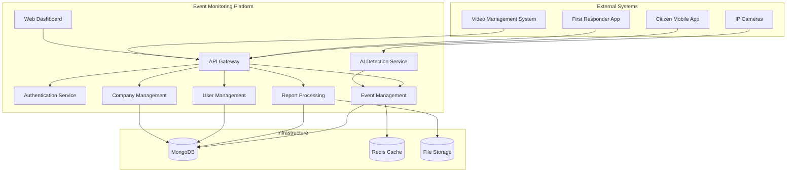
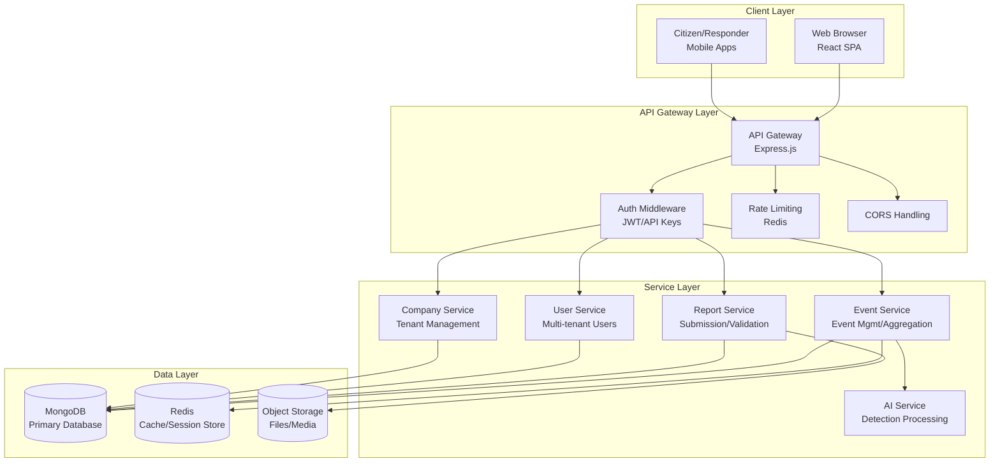
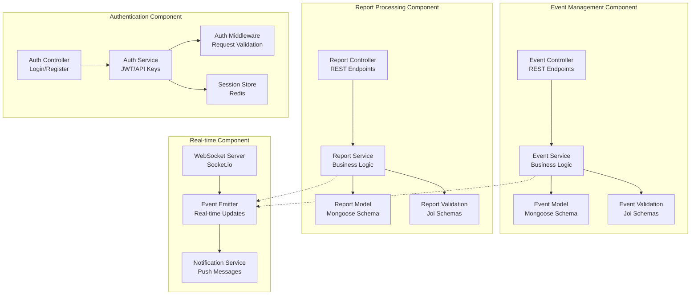
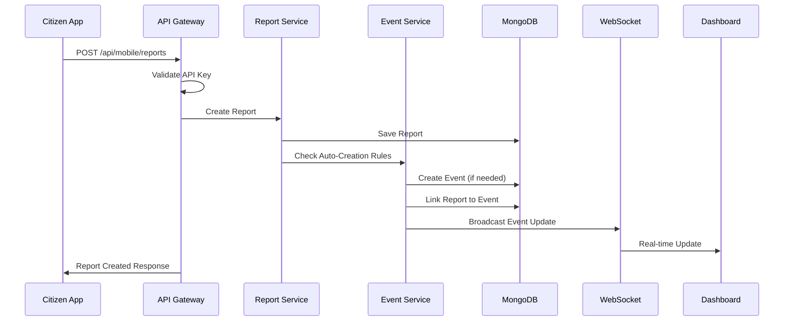
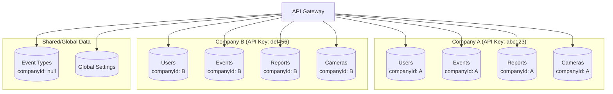
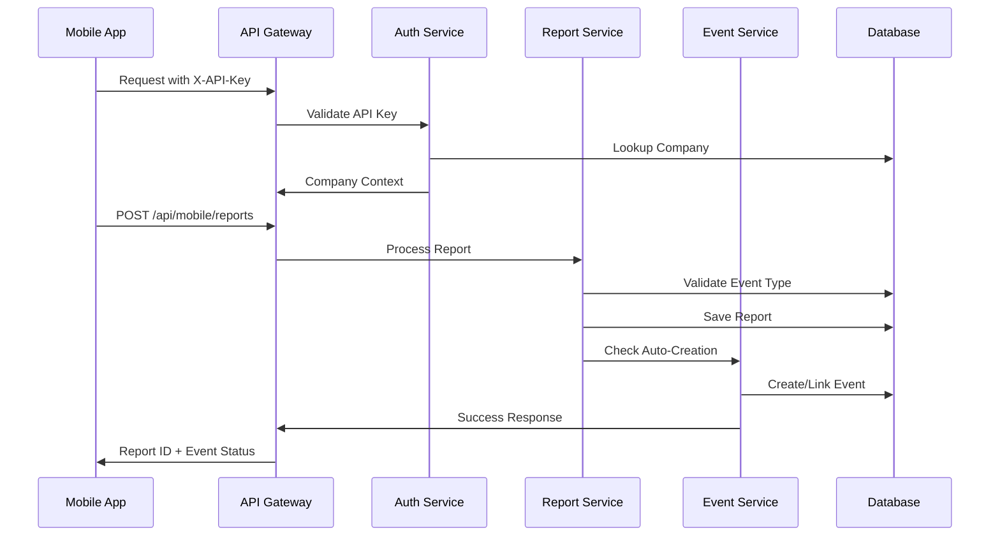
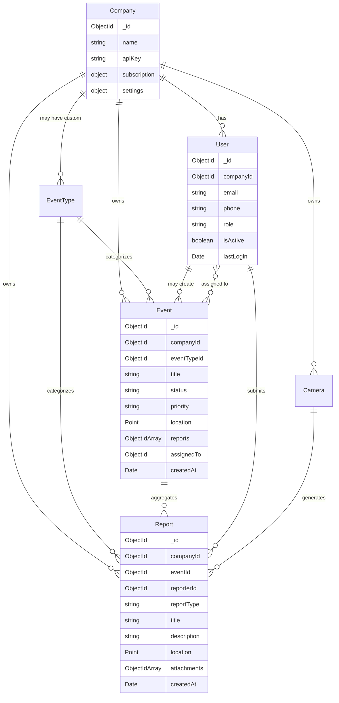
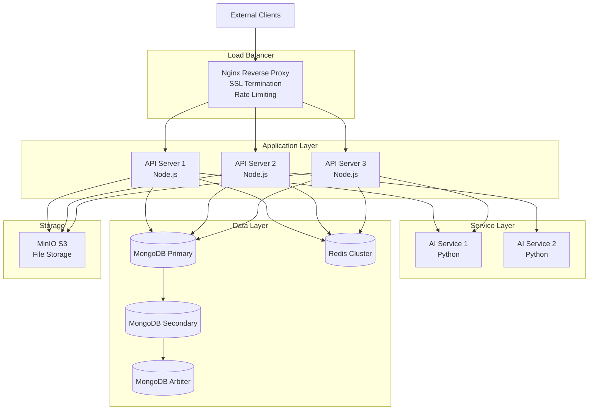
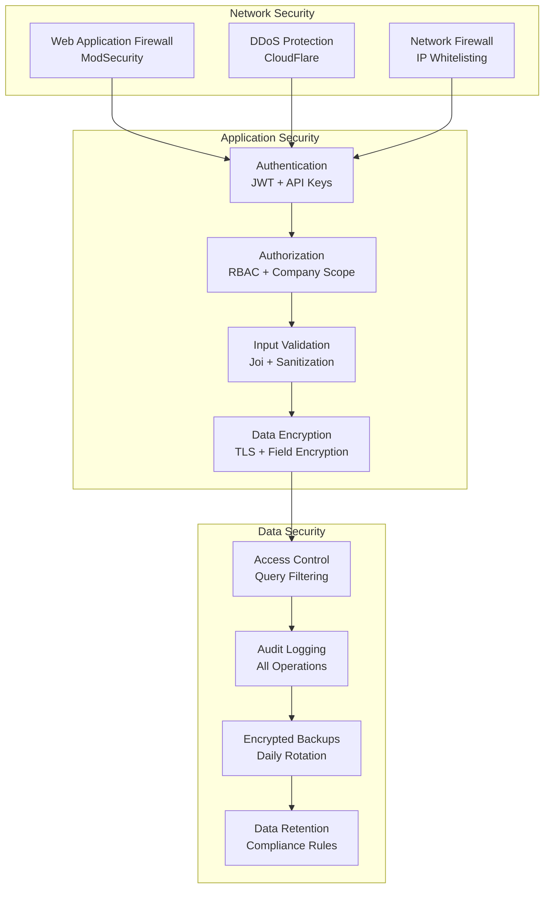

# Architecture Diagrams

This document contains the key architectural diagrams for the Event Monitoring and Management Platform, illustrating the system design, data flows, and component interactions.

## Table of Contents
1. [System Context Diagram](#system-context-diagram)
2. [Container Architecture](#container-architecture)
3. [Component Architecture](#component-architecture)
4. [Data Flow Diagrams](#data-flow-diagrams)
5. [Multi-Tenant Architecture](#multi-tenant-architecture)
6. [Mobile Integration Flow](#mobile-integration-flow)
7. [Real-time Communication](#real-time-communication)

## System Context Diagram



## Container Architecture



## Component Architecture



## Data Flow Diagrams

### Event Creation Flow



### Multi-Tenant Data Isolation



## Multi-Tenant Architecture

```mermaid
graph TB
    subgraph "Tenant Isolation Layers"
        APIKey[API Key Validation<br/>X-API-Key Header]
        CompanyCtx[Company Context<br/>Request.company]
        DataFilter[Data Filtering<br/>companyId: {$eq: ctx.companyId}]
        Permission[Permission Check<br/>Role + Company Scope]
    end

    subgraph "Database Collections"
        Companies[(Companies)]
        Users[(Users<br/>companyId indexed)]
        Events[(Events<br/>companyId indexed)]
        Reports[(Reports<br/>companyId indexed)]
        Cameras[(Cameras<br/>companyId indexed)]
        EventTypes[(Event Types<br/>companyId nullable)]
    end

    APIKey --> CompanyCtx
    CompanyCtx --> DataFilter
    CompanyCtx --> Permission

    DataFilter --> Users
    DataFilter --> Events
    DataFilter --> Reports
    DataFilter --> Cameras

    Permission --> Companies
    Permission --> EventTypes
```

## Mobile Integration Flow



## Real-time Communication

```mermaid
graph TD
    subgraph "WebSocket Architecture"
        Client[Web Dashboard<br/>Socket.io Client]
        Gateway[API Gateway<br/>Socket.io Server]
        Redis[Redis Adapter<br/>Cluster Support]
        EventBus[Event Bus<br/>Internal Events]
    end

    subgraph "Event Types"
        EventCreated[EVENT_CREATED<br/>New incident]
        EventUpdated[EVENT_UPDATED<br/>Status/location change]
        ReportSubmitted[REPORT_SUBMITTED<br/>New report]
        LocationUpdate[LOCATION_UPDATE<br/>Responder tracking]
        Notification[NOTIFICATION<br/>System alerts]
    end

    subgraph "Broadcast Groups"
        CompanyRoom[Company Room<br/>company_{id}]
        UserRoom[User Room<br/>user_{id}]
        GlobalRoom[Global Room<br/>system]
    end

    Client --> Gateway
    Gateway --> Redis
    Gateway --> EventBus

    EventBus --> EventCreated
    EventBus --> EventUpdated
    EventBus --> ReportSubmitted
    EventBus --> LocationUpdate
    EventBus --> Notification

    EventCreated --> CompanyRoom
    EventUpdated --> CompanyRoom
    ReportSubmitted --> CompanyRoom
    LocationUpdate --> UserRoom
    Notification --> GlobalRoom
```

## Database Schema Relationships



## Deployment Architecture



## Security Architecture



## Performance Architecture

```mermaid
graph TD
    subgraph "Caching Layers"
        CDN[CDN<br/>Static Assets]
        AppCache[Application Cache<br/>Redis]
        DBCache[Database Cache<br/>MongoDB WiredTiger]
    end

    subgraph "Optimization Strategies"
        ConnectionPool[Connection Pooling<br/>MongoDB]
        QueryOptimization[Query Optimization<br/>Indexes + Aggregation]
        Compression[Response Compression<br/>Gzip]
        Pagination[Cursor Pagination<br/>Large Datasets]
    end

    subgraph "Monitoring"
        APM[Application Performance<br/>New Relic]
        Metrics[Custom Metrics<br/>Prometheus]
        Alerts[Alerting<br/>PagerDuty]
    end

    CDN --> AppCache
    AppCache --> DBCache

    ConnectionPool --> QueryOptimization
    QueryOptimization --> Compression
    Compression --> Pagination

    APM --> Metrics
    Metrics --> Alerts
```



These diagrams provide a comprehensive view of the Event Monitoring Platform's architecture, showing how components interact, data flows through the system, and how multi-tenant isolation is maintained across all layers.