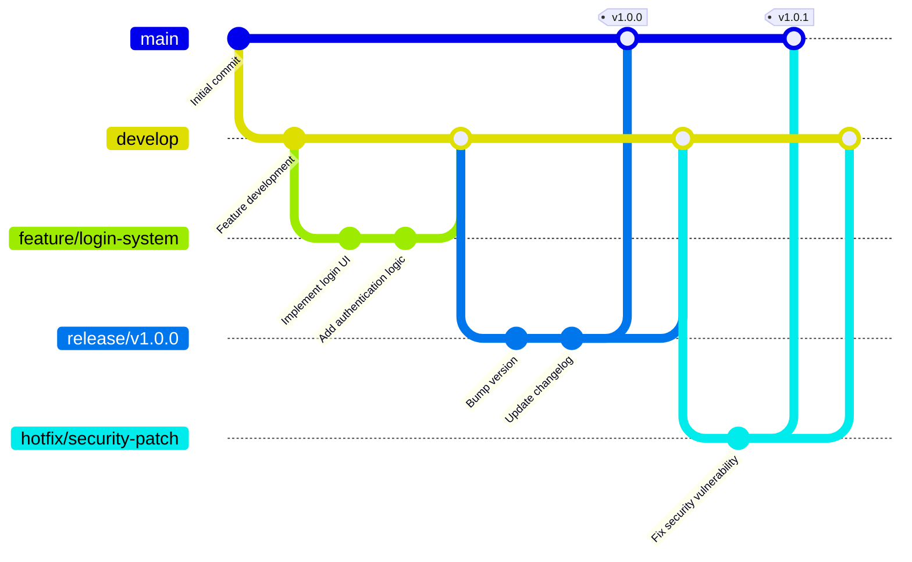

# Development Workflow

This document outlines the development processes, tools, and best practices for the Event Monitoring Platform. Following these guidelines ensures code quality, collaboration efficiency, and successful project delivery.

## Table of Contents
1. [Git Workflow](#git-workflow)
2. [Branching Strategy](#branching-strategy)
3. [Code Review Process](#code-review-process)
4. [Testing Strategy](#testing-strategy)
5. [CI/CD Pipeline](#cicd-pipeline)
6. [Development Environment](#development-environment)
7. [Code Quality Standards](#code-quality-standards)
8. [Release Process](#release-process)

## Git Workflow

### Git Flow Strategy

We use a modified Git Flow approach optimized for continuous deployment:



### Branch Naming Convention

- `main`: Production-ready code
- `develop`: Integration branch for features
- `feature/`: New features (e.g., `feature/user-authentication`)
- `bugfix/`: Bug fixes (e.g., `bugfix/login-validation`)
- `hotfix/`: Critical production fixes (e.g., `hotfix/security-patch`)
- `release/`: Release preparation (e.g., `release/v1.2.0`)

### Commit Message Standards

Follow conventional commit format:

```
type(scope): description

[optional body]

[optional footer]
```

**Types:**
- `feat`: New feature
- `fix`: Bug fix
- `docs`: Documentation changes
- `style`: Code style changes (formatting, etc.)
- `refactor`: Code refactoring
- `test`: Adding or updating tests
- `chore`: Maintenance tasks

**Examples:**
```
feat(auth): add JWT token refresh functionality

fix(api): resolve memory leak in event processing

docs(api): update endpoint documentation for reports

test(events): add unit tests for event validation
```

## Branching Strategy

### Feature Development

1. **Create Feature Branch**
   ```bash
   git checkout develop
   git pull origin develop
   git checkout -b feature/user-profile-page
   ```

2. **Develop and Commit**
   ```bash
   # Make changes
   git add .
   git commit -m "feat(profile): implement user profile page"
   ```

3. **Push and Create PR**
   ```bash
   git push origin feature/user-profile-page
   # Create pull request on GitHub
   ```

### Hotfix Process

1. **Create Hotfix Branch**
   ```bash
   git checkout main
   git pull origin main
   git checkout -b hotfix/critical-security-fix
   ```

2. **Implement Fix**
   ```bash
   # Fix the issue
   git add .
   git commit -m "fix(security): patch XSS vulnerability"
   ```

3. **Merge to Main and Develop**
   ```bash
   git checkout main
   git merge hotfix/critical-security-fix
   git tag -a v1.1.1 -m "Security hotfix"
   git push origin main --tags

   git checkout develop
   git merge hotfix/critical-security-fix
   git push origin develop
   ```

## Code Review Process

### Pull Request Guidelines

**Before Creating PR:**
- [ ] All tests pass locally
- [ ] Code follows style guidelines
- [ ] Documentation updated
- [ ] Self-review completed
- [ ] Branch up-to-date with develop

**PR Template:**
```markdown
## Description
Brief description of changes

## Type of Change
- [ ] Bug fix
- [ ] New feature
- [ ] Breaking change
- [ ] Documentation update

## Testing
- [ ] Unit tests added/updated
- [ ] Integration tests pass
- [ ] Manual testing completed

## Screenshots (if applicable)
Add screenshots of UI changes

## Checklist
- [ ] Code follows style guidelines
- [ ] Documentation updated
- [ ] Tests pass
- [ ] No security vulnerabilities
```

### Review Process

1. **Automated Checks**: CI runs tests, linting, security scans
2. **Peer Review**: At least one team member reviews code
3. **Approval**: Code owner approves changes
4. **Merge**: Squash merge to develop branch

### Code Review Checklist

**For Reviewers:**
- [ ] Code is readable and well-documented
- [ ] Business logic is correct
- [ ] Security best practices followed
- [ ] Performance considerations addressed
- [ ] Tests are comprehensive
- [ ] No hardcoded secrets or credentials
- [ ] Error handling is appropriate
- [ ] Database queries are optimized

## Testing Strategy

### Testing Pyramid

```
End-to-End Tests (5%)
    ↕
Integration Tests (15%)
    ↕
Unit Tests (80%)
```

### Unit Testing

**Frontend (Jest + React Testing Library):**
```typescript
describe('EventCard', () => {
  it('displays event title and status', () => {
    const event = {
      id: '1',
      title: 'Test Event',
      status: 'active',
      priority: 'high'
    };

    render(<EventCard event={event} />);

    expect(screen.getByText('Test Event')).toBeInTheDocument();
    expect(screen.getByText('active')).toBeInTheDocument();
  });
});
```

**Backend (Jest + Supertest):**
```typescript
describe('POST /api/events', () => {
  it('creates new event with valid data', async () => {
    const eventData = {
      title: 'Test Event',
      eventTypeId: testEventTypeId,
      companyId: testCompanyId
    };

    const response = await request(app)
      .post('/api/events')
      .set('Authorization', `Bearer ${testToken}`)
      .send(eventData)
      .expect(201);

    expect(response.body.title).toBe('Test Event');
  });
});
```

### Integration Testing

**API Integration Tests:**
```typescript
describe('Event Report Flow', () => {
  it('creates event from citizen report', async () => {
    // Submit citizen report
    const reportResponse = await request(app)
      .post('/api/mobile/reports')
      .set('X-API-Key', testApiKey)
      .send(citizenReportData);

    // Verify event was created
    const eventResponse = await request(app)
      .get(`/api/events/${reportResponse.body.eventId}`)
      .set('Authorization', `Bearer ${adminToken}`);

    expect(eventResponse.body.reports).toContain(reportResponse.body._id);
  });
});
```

### End-to-End Testing

**Using Cypress:**
```typescript
describe('Event Management', () => {
  it('allows operator to create and assign event', () => {
    cy.login('operator@test.com', 'password');

    cy.visit('/events');
    cy.get('[data-cy=create-event]').click();

    cy.get('[data-cy=event-title]').type('Test Incident');
    cy.get('[data-cy=event-type]').select('Security');
    cy.get('[data-cy=submit]').click();

    cy.get('[data-cy=event-list]').should('contain', 'Test Incident');
  });
});
```

### Test Coverage Requirements

- **Unit Tests**: Minimum 80% coverage
- **Integration Tests**: All critical user journeys
- **E2E Tests**: Core workflows and user journeys

## CI/CD Pipeline

### GitHub Actions Workflow

```yaml
name: CI/CD Pipeline

on:
  push:
    branches: [ main, develop ]
  pull_request:
    branches: [ main, develop ]

jobs:
  test:
    runs-on: ubuntu-latest
    services:
      mongodb:
        image: mongo:6.0
        ports:
          - 27017:27017

    steps:
      - uses: actions/checkout@v3

      - name: Setup Node.js
        uses: actions/setup-node@v3
        with:
          node-version: '18'

      - name: Install dependencies
        run: npm ci

      - name: Run linting
        run: npm run lint

      - name: Run tests
        run: npm run test:ci

      - name: Upload coverage
        uses: codecov/codecov-action@v3

  security:
    runs-on: ubuntu-latest
    steps:
      - uses: actions/checkout@v3
      - name: Run security scan
        uses: securecodewarrior/github-action-gosec@master
        with:
          args: './...'

  deploy-staging:
    needs: [test, security]
    if: github.ref == 'refs/heads/develop'
    runs-on: ubuntu-latest
    steps:
      - name: Deploy to staging
        run: |
          echo "Deploy to staging environment"

  deploy-production:
    needs: [test, security]
    if: github.ref == 'refs/heads/main'
    runs-on: ubuntu-latest
    steps:
      - name: Deploy to production
        run: |
          echo "Deploy to production environment"
```

### Pipeline Stages

1. **Lint**: Code style and formatting checks
2. **Test**: Unit and integration tests
3. **Security**: Vulnerability scanning
4. **Build**: Docker image creation
5. **Deploy**: Environment-specific deployment

## Development Environment

### Local Setup

**Prerequisites:**
- Node.js 18+
- Python 3.9+
- Docker Desktop
- Git

**Setup Steps:**
```bash
# Clone repository
git clone <repository-url>
cd event-monitoring-mvp

# Start infrastructure
docker-compose up -d mongodb redis

# Backend setup
cd backend
npm install
cp .env.example .env
npm run setup-db
npm run dev

# Frontend setup (new terminal)
cd frontend
npm install
cp .env.example .env
npm start

# AI service setup (new terminal)
cd ai-service
pip install -r requirements.txt
python main.py
```

### Environment Configuration

**.env Structure:**
```bash
# Application
NODE_ENV=development
PORT=3000

# Database
MONGODB_URI=mongodb://localhost:27017/event-monitoring-dev

# Authentication
JWT_SECRET=your-super-secret-jwt-key
JWT_EXPIRES_IN=24h

# External Services
REDIS_URL=redis://localhost:6379

# File Storage
AWS_S3_BUCKET=dev-event-monitoring-files
AWS_ACCESS_KEY_ID=your-access-key
AWS_SECRET_ACCESS_KEY=your-secret-key

# AI Service
AI_SERVICE_URL=http://localhost:8000

# Email (optional)
SMTP_HOST=smtp.gmail.com
SMTP_PORT=587
SMTP_USER=your-email@gmail.com
SMTP_PASS=your-app-password
```

## Code Quality Standards

### TypeScript Standards

**tsconfig.json:**
```json
{
  "compilerOptions": {
    "target": "ES2020",
    "module": "commonjs",
    "strict": true,
    "esModuleInterop": true,
    "skipLibCheck": true,
    "forceConsistentCasingInFileNames": true,
    "resolveJsonModule": true,
    "declaration": true,
    "outDir": "./dist",
    "rootDir": "./src"
  },
  "include": ["src/**/*"],
  "exclude": ["node_modules", "dist", "**/*.test.ts"]
}
```

### ESLint Configuration

**.eslintrc.js:**
```javascript
module.exports = {
  env: {
    node: true,
    es2021: true,
  },
  extends: [
    'eslint:recommended',
    '@typescript-eslint/recommended',
    'prettier',
  ],
  parser: '@typescript-eslint/parser',
  parserOptions: {
    ecmaVersion: 12,
    sourceType: 'module',
  },
  plugins: ['@typescript-eslint'],
  rules: {
    '@typescript-eslint/no-unused-vars': ['error', { argsIgnorePattern: '^_' }],
    '@typescript-eslint/explicit-function-return-type': 'warn',
    '@typescript-eslint/no-explicit-any': 'warn',
  },
};
```

### Pre-commit Hooks

**Husky + lint-staged:**
```json
{
  "husky": {
    "hooks": {
      "pre-commit": "lint-staged",
      "commit-msg": "commitlint -E HUSKY_GIT_PARAMS"
    }
  },
  "lint-staged": {
    "*.{ts,tsx}": [
      "eslint --fix",
      "prettier --write",
      "jest --findRelatedTests --passWithNoTests"
    ],
    "*.{json,md}": [
      "prettier --write"
    ]
  }
}
```

## Release Process

### Version Numbering

Follow [Semantic Versioning](https://semver.org/):
- **MAJOR**: Breaking changes
- **MINOR**: New features (backward compatible)
- **PATCH**: Bug fixes (backward compatible)

### Release Steps

1. **Create Release Branch**
   ```bash
   git checkout develop
   git pull origin develop
   git checkout -b release/v1.2.0
   ```

2. **Update Version**
   ```bash
   # Update package.json
   npm version 1.2.0 --no-git-tag-version

   # Update changelog
   # Update version in docs
   ```

3. **Testing**
   ```bash
   # Run full test suite
   npm run test

   # Manual testing checklist
   # - All user journeys work
   # - No regressions
   # - Performance acceptable
   ```

4. **Merge and Tag**
   ```bash
   git checkout main
   git merge release/v1.2.0
   git tag -a v1.2.0 -m "Release version 1.2.0"
   git push origin main --tags

   git checkout develop
   git merge release/v1.2.0
   git push origin develop

   git branch -d release/v1.2.0
   ```

5. **Deploy**
   ```bash
   # Trigger production deployment
   # Update documentation
   # Notify stakeholders
   ```

### Rollback Procedure

If issues are discovered post-release:

1. **Assess Impact**: Determine severity and user impact
2. **Create Hotfix**: If critical, create hotfix branch from main
3. **Deploy Previous Version**: Roll back to previous stable version
4. **Investigate**: Root cause analysis and fix development
5. **Re-release**: Deploy corrected version

This development workflow ensures consistent, high-quality code delivery while maintaining system stability and enabling rapid iteration.